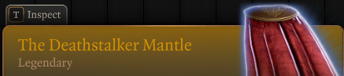

# Legendary Deathstalker Mantle


A mod for [Baldur's Gate 3](https://baldursgate3.game/).\
Nexus Mods Mirror: [https://www.nexusmods.com/baldursgate3/mods/23070](https://www.nexusmods.com/baldursgate3/mods/23070)

## Description
Changes the rarity of [**The Deathstalker Mantle**](https://bg3.wiki/wiki/The_Deathstalker_Mantle) from **Rare** to **Legendary**. It is a purely cosmetic change.

> *Let hill and hollow be a door*\
> *To screams that last forevermore*

## Compatibility
Created for and working on **Patch 8** as of 2026-05-26.
May conflict with mods that also edit the stats entry `UNI_DarkUrge_Bhaal_Cloak`.

## Installation
1. Unzip `LegendaryDeathstalkerMantle.zip`
2. Copy `LegendaryDeathstalkerMantle.pak` to the Mods folder
```
Windows: %LOCALAPPDATA%\Larian Studios\Baldur's Gate 3\Mods
Linux  : ~/.local/share/Larian Studios/Baldur's Gate 3/Mods
```
3. Enable *Legendary Deathstalker Mantle* in the in-game mod manager or in a preferred mod manager.

## Method
The original entry was found in the unpacked game data at:
```
UnpackedMods/Gustav/Public/GustavDev/Stats/Generated/Data/Armor.txt
```
```
new entry "UNI_DarkUrge_Bhaal_Cloak"
type "Armor"
using "_Back_Magic"
data "RootTemplate" "dff731f7-d6da-403d-80cf-7f3d9cc7345b"
data "ValueUUID" "a229f048-70b0-4b0c-88cb-29b5c6bdb2d0"
data "Rarity" "Rare"
data "PassivesOnEquip" "UNI_DarkUrge_Stealth_Expertise_Passive"
data "Unique" "1"
```
The mod includes the override at:
```
Public/LegendaryDeathstalkerMantle/Stats/Generated/Data/Armor.txt
```
```
new entry "UNI_DarkUrge_Bhaal_Cloak"
type "Armor"
using "_Back_Magic"
data "RootTemplate" "dff731f7-d6da-403d-80cf-7f3d9cc7345b"
data "ValueUUID" "a229f048-70b0-4b0c-88cb-29b5c6bdb2d0"
data "Rarity" "Legendary"
data "PassivesOnEquip" "UNI_DarkUrge_Stealth_Expertise_Passive"
data "Unique" "1"
```

## References
[bg3.wiki - Modding Resources](https://bg3.wiki/wiki/Modding:Creating_meta.lsx)\
[bg3.wiki - The Deathstalker Mantle](https://bg3.wiki/wiki/The_Deathstalker_Mantle)\
[Baldur's Gate 3 Modder's Multitool](https://github.com/ShinyHobo/BG3-Modders-Multitool)
